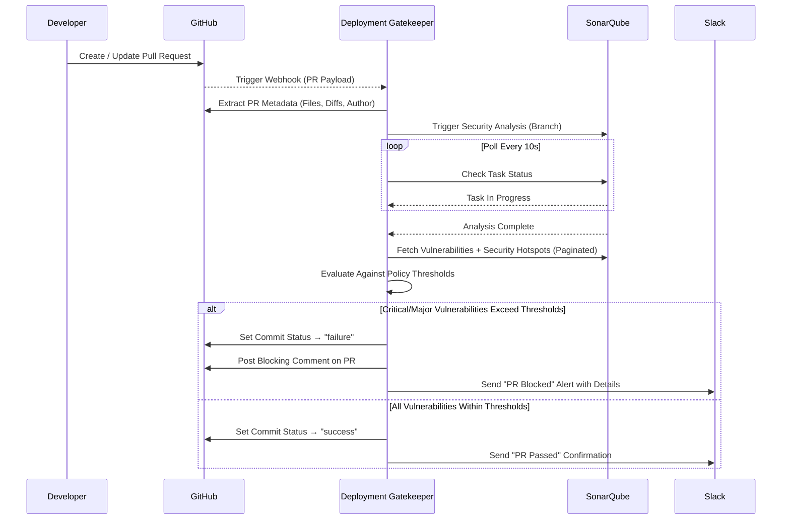

```markdown
<div align="center">

# 🛡️ DevSecOps Deployment Gatekeeper

**AI-Powered Security Gate for CI/CD Pipelines**

[](https://www.python.org/downloads/)
[](LICENSE)
[](https://github.com/psf/black)
[](http://mypy-lang.org/)
[](https://github.com/astral-sh/ruff)
[](https://github.com/pre-commit/pre-commit)

[](https://github.com/your-org/devops-deployment-security-gate/actions/workflows/ci.yml)
[](https://github.com/your-org/devops-deployment-security-gate/actions/workflows/security-scan.yml)
[](https://github.com/your-org/devops-deployment-security-gate/actions/workflows/codeql.yml)

[Features](#features) · [Architecture](#architecture) · [Quick Start](#quick-start) · [Installation](#installation) · [Configuration](#configuration) · [Deployment](#deployment) · [Monitoring](#monitoring) · [Testing](#testing) · [Contributing](#contributing)

</div>

---

## Overview

The **DevSecOps Deployment Gatekeeper** is a multi-agent AI system that enforces automated security gates in your CI/CD pipeline. Built on [crewAI](https://crewai.com), it orchestrates four specialized agents that extract pull request metadata, execute SonarQube security scans, evaluate findings against organizational policy, and deliver structured alerts — all before code reaches production.

**Every pull request is automatically evaluated. Critical vulnerabilities block deployment. Your team gets instant Slack notifications with full context.**

---

## Features

- 🔍 **Automated PR Security Analysis** — Extracts metadata, diffs, and contributor context from GitHub pull requests
- 🛡️ **SonarQube Integration** — Triggers scans, paginates results, fetches vulnerabilities and security hotspots
- ⚖️ **Policy-as-Code Decision Engine** — Configurable thresholds for critical/major vulnerabilities with deterministic enforcement
- 📢 **Slack Alert Notifications** — Structured block-kit messages with severity breakdowns and override audit trails
- 🐳 **Production-Ready Containerization** — Multi-stage Docker build with layer caching, non-root user, and health checks
- 📊 **Prometheus Metrics** — Native exposition format for scan durations, decision counts, and system health
- 🔐 **Zero Hardcoded Secrets** — All credentials via environment variables; `.env` gitignored; `.dockerignore` prevents secret leakage into images
- ✅ **Proper Test Infrastructure** — pytest with `conftest` fixtures, mock-first unit tests, `@pytest.mark.integration` for live API tests
- 🔄 **GitHub Actions Integration** — PR-triggered security scans with commit status reporting and blocking comments

---

## Architecture

### Multi-Agent Workflow



### Agent Roles

| Agent | Responsibility | LLM-Driven? |
|-------|---------------|-------------|
| **PR Metadata Extraction Specialist** | Extracts PR context, changed files, author history from GitHub | Yes |
| **SonarQube Security Scanner** | Triggers scans, fetches paginated vulnerability + hotspot results | Yes |
| **Security Policy Decision Engine** | Interprets LLM-enriched analysis, delegates to deterministic `PolicyEvaluator` | Partial — LLM interpretation + deterministic policy enforcement |
| **Security Alert Notification Manager** | Formats and delivers structured Slack notifications | Yes |

> **Design note:** The `PolicyEvaluator` is a standalone service class — deterministic threshold logic is **not** routed through an LLM. The agent interprets context; the evaluator enforces policy.

### System Components

```
┌─────────────────────────────────────────────────────────────────┐
│                     CI/CD Pipeline (GitHub Actions)              │
│  ┌──────────────┐  ┌──────────────┐  ┌──────────────────────┐  │
│  │ security-scan │  │     ci       │  │     codeql           │  │
│  │   (PR gate)   │  │ (lint+test)  │  │  (SAST analysis)     │  │
│  └──────┬───────┘  └──────┬───────┘  └──────────────────────┘  │
└─────────┼─────────────────┼────────────────────────────────────┘
          │                 │
          ▼                 ▼
┌─────────────────────────────────────────────────────────────────┐
│                   DevSecOps Gatekeeper Service                   │
│  ┌─────────┐ ┌─────────┐ ┌──────────────┐ ┌────────────────┐  │
│  │PR Extract│ │Scanner  │ │Decision Engine│ │Notif. Manager  │  │
│  └────┬─────┘ └────┬────┘ └──────┬───────┘ └───────┬────────┘  │
│       │             │             │                  │           │
│       ▼             ▼             ▼                  ▼           │
│  ┌──────────┐ ┌──────────┐ ┌────────────┐ ┌───────────────┐   │
│  │GitHub API│ │SonarQube │ │PolicyEval. │ │  Slack API    │   │
│  │  Tool    │ │  Tool    │ │ (determin.)│ │    Tool       │   │
│  └──────────┘ └──────────┘ └────────────┘ └───────────────┘   │
│                                                                  │
│  ┌─────────────────────┐  ┌──────────────────────────────────┐ │
│  │   Health Server     │  │   Prometheus Metrics Endpoint    │ │
│  │   :8090/health      │  │   :8090/metrics                 │ │
│  └─────────────────────┘  └──────────────────────────────────┘ │
└─────────────────────────────────────────────────────────────────┘
          │                              │
          ▼                              ▼
   ┌─────────────┐              ┌──────────────┐
   │   GitHub    │              │  Prometheus   │──→ Grafana
   └─────────────┘              └──────────────┘
```

---

## Quick Start

```bash
# 1. Clone the repository
git clone https://github.com/your-org/devops-deployment-security-gate.git
cd devops-deployment-security-gate

# 2. Set up environment
cp .env.example .env
# Edit .env with your credentials (see Configuration section)

# 3. Install dependencies
pip install -r requirements.txt
pip install -e .

# 4. Verify installation
devsecops-gate --help
python -c "import devops_deployment_security_gate; print(devops_deployment_security_gate.__version__)"
# → 1.0.0

# 5. Run a security gate check
devsecops-gate run --pr-number 123 --repository myorg/myrepo --branch feature-branch
```

---

## Installation

### Prerequisites

| Requirement | Version | Notes |
|-------------|---------|-------|
| Python | 3.10 – 3.12 | 3.13 not yet tested |
| SonarQube | 9.4+ | Server instance with project configured |
| `sonar-scanner` CLI | 4.8+ | Must be on `PATH` for scan triggering |
| GitHub Token | — | `repo` scope for PR access and commit status |
| Slack Bot Token | — | `chat:write` scope for channel notifications |

### Install with pip

```bash
# Production dependencies only
pip install -r requirements.txt

# Include development tooling (lint, type-check, test)
pip install -r requirements-dev.txt

# Install the package in editable mode
pip install -e .
```

### Install with UV (recommended)

```bash
pip install uv
uv pip install -r requirements.txt
uv pip install -e .
```

### Install with crewAI CLI

```bash
crewai install
```

---

## Configuration

### Environment Variables

All configuration is provided via environment variables. **Never commit `.env` to version control** — it is gitignored by default.

```bash
cp .env.example .env
```

| Variable | Description | Required | Default |
|----------|-------------|----------|---------|
| **AI / LLM** | | | |
| `OPENAI_API_KEY` | OpenAI API key for crewAI agents | ✅ | — |
| `OPENAI_MODEL` | Model identifier | ❌ | `gpt-4` |
| `OPENAI_TEMPERATURE` | Sampling temperature (0.0–1.0) | ❌ | `0.1` |
| **GitHub** | | | |
| `GITHUB_TOKEN` | Personal access token with `repo` scope | ✅ | — |
| `GITHUB_WEBHOOK_SECRET` | Secret for webhook payload validation | ❌ | `dev-webhook-secret` |
| **SonarQube** | | | |
| `SONARQUBE_URL` | SonarQube server URL | ✅ | — |
| `SONARQUBE_TOKEN` | SonarQube authentication token | ✅ | — |
| `SONARQUBE_TIMEOUT` | Maximum wait time for analysis (seconds) | ❌ | `300` |
| `SONARQUBE_POLL_INTERVAL` | Status check interval (seconds) | ❌ | `10` |
| **Slack** | | | |
| `SLACK_BOT_TOKEN` | Bot token with `chat:write` scope | ✅ | — |
| `SLACK_SIGNING_SECRET` | Secret for request verification | ❌ | — |
| `SLACK_NOTIFICATION_CHANNEL` | Default notification channel | ❌ | `#security-alerts` |
| **Security Policy** | | | |
| `CRITICAL_VULNERABILITY_THRESHOLD` | Max critical issues allowed | ❌ | `0` |
| `MAJOR_VULNERABILITY_THRESHOLD` | Max major issues allowed | ❌ | `5` |
| `ALLOW_MANUAL_OVERRIDE` | Permit manual deployment override | ❌ | `false` |
| **Service** | | | |
| `SECRET_KEY` | Internal encryption key | ❌ | `dev-secret-key` |
| `ENABLE_METRICS` | Expose Prometheus `/metrics` endpoint | ❌ | `true` |
| `METRICS_PORT` | Metrics server port | ❌ | `8090` |

### Settings Loading

Settings are lazily initialized via `get_settings()` backed by `@lru_cache`. This allows test suites to inject mock configuration before first access:

```python
from devops_deployment_security_gate.config.settings import get_settings

settings = get_settings()  # Lazy — only validates on first call
```

---

## Usage

### CLI Commands

```bash
devsecops-gate --help
```

| Command | Description |
|---------|-------------|
| `run` | Execute the security gate on a pull request |
| `config validate` | Validate all environment configuration |

#### Run a Security Gate Check

```bash
devsecops-gate run \
  --pr-number 123 \
  --repository myorg/myrepo \
  --branch feature-branch
```

**Exit codes:**

| Code | Meaning |
|------|---------|
| `0` | Security gate passed — deployment allowed |
| `1` | Security gate blocked — critical/major issues exceed thresholds |
| `2` | Configuration or runtime error |

#### Validate Configuration

```bash
devsecops-gate config validate
```

Checks all required environment variables are set and API endpoints are reachable.

### GitHub Actions Integration

The repository includes a ready-to-use workflow at `.github/workflows/security-scan.yml`:

```yaml
name: Security Gate Check
on:
  pull_request:
    types: [opened, synchronize, reopened]

jobs:
  security-gate:
    runs-on: ubuntu-latest
    steps:
      - uses: actions/checkout@v4
      - uses: actions/setup-python@v5
        with:
          python-version: '3.12'
      - run: pip install -r requirements.txt && pip install -e .
      - run: |
          devsecops-gate run \
            --pr-number ${{ github.event.pull_request.number }} \
            --repository ${{ github.repository }} \
            --branch ${{ github.head_ref }}
        if: github.event_name == 'pull_request'
        env:
          GITHUB_TOKEN: ${{ secrets.GITHUB_TOKEN }}
          SONARQUBE_URL: ${{ secrets.SONARQUBE_URL }}
          SONARQUBE_TOKEN: ${{ secrets.SONARQUBE_TOKEN }}
          OPENAI_API_KEY: ${{ secrets.OPENAI_API_KEY }}
          SLACK_BOT_TOKEN: ${{ secrets.SLACK_BOT_TOKEN }}
      - uses: actions/github-script@v7
        if: github.event_name == 'pull_request'
        with:
          script: |
            github.rest.repos.createCommitStatus({
              owner: context.repo.owner,
              repo: context.repo.repo,
              sha: context.payload.pull_request.head.sha,
              state: '${{ job.status }}' === 'success' ? 'success' : 'failure',
              context: 'Security Gate',
              description: 'DevSecOps security gate check'
            })
```

> **Note:** The `security-scan.yml` workflow is PR-only. It does **not** trigger on push events — PR-specific steps are guarded with `if: github.event_name == 'pull_request'` to prevent null payload errors.

### Programmatic Usage

```python
from devops_deployment_security_gate.core.orchestrator import SecurityGateOrchestrator

orchestrator = SecurityGateOrchestrator(start_health_server=True)
result = orchestrator.run_security_check(
    pr_number=123,
    repository="myorg/myrepo",
    branch_name="feature-branch"
)

print(f"Decision: {result['decision']}")       # "ALLOW" or "BLOCK"
print(f"Critical issues: {result['critical_count']}")
print(f"Scan duration: {result['scan_duration']}s")
```

---

## Deployment

### Docker (Production)

The Dockerfile follows security best practices — multi-stage compatible, non-root user, no secrets in images, optimized layer caching:

```bash
# Build
docker build -t devsecops-gatekeeper:1.0.0 .

# Run (inject secrets via environment at runtime)
docker run --rm \
  --env-file .env \
  -p 8090:8090 \
  devsecops-gatekeeper:1.0.0
```

**Security guarantees:**
- `.dockerignore` excludes `.env`, `.git`, `tests/`, `docs/`, `examples/`
- No credentials are baked into the image
- Runs as non-root `appuser`
- Includes `HEALTHCHECK` instruction for container orchestration

**Layer caching:** Dependencies are installed **before** source code is copied — only source changes invalidate the application layer, not the dependency layer.

### Docker Compose (with Monitoring Stack)

```bash
# Start all services (gatekeeper + Prometheus + Grafana)
docker compose up -d

# Check health
curl http://localhost:8090/health

# View metrics
curl http://localhost:8090/metrics

# Stop
docker compose down
```

The `docker-compose.yml` passes **all** environment variables via `env_file: .env` — no partial variable lists that silently omit webhook secrets or thresholds.

#### Local Development Override

For hot-reload during development, create `docker-compose.override.yml` (gitignored):

```yaml
services:
  devsecops-gate:
    volumes:
      - ./src:/app/src
    environment:
      - DEBUG=True
```

### Kubernetes

```yaml
apiVersion: apps/v1
kind: Deployment
metadata:
  name: devsecops-gatekeeper
spec:
  replicas: 1
  selector:
    matchLabels:
      app: devsecops-gatekeeper
  template:
    metadata:
      labels:
        app: devsecops-gatekeeper
    spec:
      containers:
        - name: gatekeeper
          image: devsecops-gatekeeper:1.0.0
          ports:
            - containerPort: 8090
          envFrom:
            - secretRef:
                name: gatekeeper-secrets
          livenessProbe:
            httpGet:
              path: /health
              port: 8090
            initialDelaySeconds: 10
            periodSeconds: 30
          readinessProbe:
            httpGet:
              path: /health
              port: 8090
            initialDelaySeconds: 5
            periodSeconds: 10
```

---

## Monitoring

### Prometheus Metrics

The `/metrics` endpoint exposes native Prometheus exposition format (not JSON):

| Metric | Type | Description |
|--------|------|-------------|
| `security_gate_decisions_total` | Counter | Total gate decisions, labeled by `result` (`ALLOW` / `BLOCK`) |
| `security_gate_scan_duration_seconds` | Histogram | Duration of SonarQube scan + evaluation (actual elapsed time) |
| `security_gate_up` | Gauge | `1` if the service is running |

**Scrape configuration** (included in `prometheus.yml`):

```yaml
scrape_configs:
  - job_name: 'devsecops-gate'
    scrape_interval: 15s
    static_configs:
      - targets: ['devsecops-gate:8090']
```

### Health Endpoint

```
GET /health → 200
```

```json
{
  "status": "healthy",
  "service": "devsecops-deployment-security-gate",
  "version": "1.0.0",
  "timestamp": "2025-01-15T10:30:00+00:00"
}
```

> **Security:** The health and metrics endpoints do **not** expose security-sensitive configuration such as vulnerability thresholds, override flags, or API keys.

---

## Testing

### Running Tests

```bash
# Unit tests only (default — no live credentials needed)
python -m pytest src/tests/ -v -m "not integration"

# All tests including integration (requires real API credentials)
python -m pytest src/tests/ -v

# With coverage
python -m pytest src/tests/ -v --cov=devops_deployment_security_gate --cov-report=term-missing
```

### Test Architecture

| Layer | Marker | Requires Credentials | Purpose |
|-------|--------|---------------------|---------|
| **Unit** | `@pytest.mark.unit` | ❌ No | Agent logic, policy evaluation, model validation |
| **Integration** | `@pytest.mark.integration` | ✅ Yes | SonarQube API, GitHub API, Slack API |

**Key design decisions:**
- All unit tests use `unittest.mock.MagicMock` for tool injection — never the mock-data fallback
- `conftest.py` provides shared fixtures (`mock_settings`, `sample_security_report`) and prevents the health server from binding during tests
- Test path resolution is handled by `pyproject.toml` `[tool.pytest.ini_options]` — no `sys.path` hacks in test files

### Example: Testing with Mocked Tools

```python
from unittest.mock import MagicMock
from devops_deployment_security_gate.agents.scanner_agent import SonarQubeSecurityScanner

def test_scanner_uses_tool_when_available():
    mock_tool = MagicMock()
    mock_tool.name = "SonarQube Scanner Tool"
    mock_tool._run.return_value = {"critical_count": 0, "major_count": 1}

    scanner = SonarQubeSecurityScanner(tools=[mock_tool])
    result = scanner.execute_security_scan(
        repository="org/repo",
        branch="main",
        sonarqube_url="https://sonar.example.com"
    )

    mock_tool._run.assert_called_once()

def test_scanner_raises_without_tool():
    scanner = SonarQubeSecurityScanner(tools=[])
    # After IMP-29 fix: raises RuntimeError instead of returning mock data
    with pytest.raises(RuntimeError, match="tool not found"):
        scanner.execute_security_scan(
            repository="org/repo",
            branch="main",
            sonarqube_url="https://sonar.example.com"
        )
```

---

## Project Structure

```
devops-deployment-security-gate/
├── .github/
│   └── workflows/
│       ├── ci.yml                    # Lint + unit tests
│       ├── security-scan.yml         # PR security gate
│       └── codeql.yml                # CodeQL SAST analysis
├── src/
│   └── devops_deployment_security_gate/
│       ├── __init__.py               # Package with importlib.metadata version
│       ├── main.py                   # CLI entry point (devsecops-gate)
│       ├── agents/
│       │   ├── pr_extractor.py       # PR metadata extraction agent
│       │   ├── scanner_agent.py      # SonarQube security scanner agent
│       │   ├── decision_engine.py    # Policy decision agent (delegates to PolicyEvaluator)
│       │   └── notification_manager.py # Slack notification agent
│       ├── config/
│       │   ├── agents.yaml           # Agent definitions
│       │   ├── tasks.yaml            # Task definitions
│       │   └── settings.py           # Pydantic settings with lazy init
│       ├── core/
│       │   ├── crew.py               # crewAI crew definition + cached kickoff
│       │   ├── orchestrator.py       # Security gate orchestrator
│       │   └── policy_evaluator.py   # Deterministic policy enforcement (no LLM)
│       ├── integrations/
│       │   ├── github.py             # GitHub API (Bearer auth)
│       │   ├── sonarqube.py          # SonarQube API (paginated, CLI-triggered)
│       │   └── slack.py              # Slack API
│       ├── models/
│       │   └── security.py           # Pydantic v2 models with Literal types
│       ├── tasks/
│       │   ├── base_task.py          # ConfigurableTask base class
│       │   ├── pr_extraction_task.py
│       │   ├── scan_task.py
│       │   ├── decision_task.py
│       │   └── notification_task.py
│       ├── tools/
│       │   ├── base_tool.py          # DevSecOpsBaseTool with domain exceptions
│       │   ├── github_tool.py
│       │   ├── sonarqube_scanner.py
│       │   └── slack_tool.py
│       ├── utils/
│       │   ├── validators.py         # Shared validation functions
│       │   └── exceptions.py         # Domain exception hierarchy
│       ├── health.py                 # Health check + operational metrics
│       └── web.py                    # HTTP server with Prometheus /metrics
├── tests/
│   ├── conftest.py                   # Shared fixtures, mock_settings, autouse guards
│   ├── test_agents.py
│   ├── test_integrations.py
│   ├── test_models.py
│   └── test_policy_evaluator.py
├── docs/
│   ├── architecture.md               # System architecture and design decisions
│   ├── deployment.md                 # Deployment guide (Docker, K8s, manual)
│   ├── security.md                   # Security model and hardening guide
│   └── comprehensive_guide.md        # Full usage documentation
├── examples/
│   ├── github_action_example.yml
│   └── security_check_example.py
├── .dockerignore                     # Prevents .env and secrets in Docker images
├── .env.example                      # Template — copy to .env, never commit
├── .gitignore                        # Includes .env, egg-info, dist, build
├── .pre-commit-config.yaml           # pre-commit hooks (black, flake8, mypy)
├── Dockerfile                        # Production-ready with layer caching
├── docker-compose.yml                # App + Prometheus + Grafana (env_file: .env)
├── prometheus.yml                    # Scrape config for gatekeeper metrics
├── pyproject.toml                    # Single source of truth for build config
├── requirements.txt                  # Production dependencies only
├── requirements-dev.txt              # Dev tooling (inherits from requirements.txt)
└── README.md                         # This file
```

---

## Security Model

### Secret Management

| Principle | Implementation |
|-----------|---------------|
| No secrets in version control | `.env` is in `.gitignore` — credentials are never committed |
| No secrets in container images | `.dockerignore` excludes `.env` and `*.env` from Docker context |
| No secrets in metrics | `/metrics` endpoint exposes operational data only — no thresholds, tokens, or override flags |
| Runtime injection only | Docker and K8s pass secrets via `env_file` or `secretRef` at startup |

### Authentication

| Service | Auth Method | Notes |
|---------|------------|-------|
| GitHub API | `Bearer` token | Updated from deprecated `token` scheme; required for fine-grained PATs |
| SonarQube API | Bearer token | Passed in `Authorization` header |
| Slack API | Bot token | `xoxb-` prefix, `chat:write` scope |
| GitHub Webhooks | HMAC-SHA256 | Validated against `GITHUB_WEBHOOK_SECRET` |

### Input Validation

All external inputs are validated through centralized validators in `utils/validators.py`:

- `validate_github_repo_format(repo)` — Enforces `owner/repo` format
- `validate_pr_number(pr_number)` — Positive integer check
- `validate_branch_name(branch)` — Non-empty, no path traversal

### Policy Enforcement

The `PolicyEvaluator` is a **deterministic service class** — it does not use an LLM:

```python
from devops_deployment_security_gate.core.policy_evaluator import PolicyEvaluator

evaluator = PolicyEvaluator(
    critical_threshold=0,    # Zero critical issues allowed
    major_threshold=5,       # Up to 5 major issues allowed
    allow_override=False     # No manual bypass
)

decision = evaluator.evaluate(security_report)
# decision.decision → Literal["ALLOW", "BLOCK"]
# decision.reasoning → Full explanation
```

---

## Customization

### Agent Configuration

Edit `src/devops_deployment_security_gate/config/agents.yaml` to modify agent roles, goals, and backstories:

```yaml
pr_metadata_extraction_specialist:
  role: >
    PR Metadata Extraction Specialist
  goal: >
    Extract comprehensive security-relevant context from pull requests
  backstory: >
    You are a security-focused code reviewer who identifies risky changes...
```

### Task Definitions

Edit `src/devops_deployment_security_gate/config/tasks.yaml` to modify task descriptions and expected outputs.

### Policy Thresholds

Set via environment variables — no code changes required:

```bash
# Block any PR with critical vulnerabilities
CRITICAL_VULNERABILITY_THRESHOLD=0

# Allow up to 5 major vulnerabilities
MAJOR_VULNERABILITY_THRESHOLD=5

# Disable manual override (production)
ALLOW_MANUAL_OVERRIDE=false
```

### Adding Custom Tools

1. Create a new tool in `src/devops_deployment_security_gate/tools/`
2. Subclass `DevSecOpsBaseTool` for automatic error handling with domain exceptions
3. Register the tool in the agent's tool list in `core/crew.py`

---

## Troubleshooting

### Common Issues

<details>
<summary><strong>🔐 Authentication Errors</strong></summary>

```
Error: 401 Unauthorized from GitHub API
```

**Checks:**
1. Verify `GITHUB_TOKEN` is set: `echo $GITHUB_TOKEN | head -c 10`
2. Token must use `Bearer` scheme (modern fine-grained PATs require this)
3. Token requires `repo` scope for commit status and PR comments
4. If using fine-grained PATs, ensure the repository is in the token's access list

</details>

<details>
<summary><strong>🔍 SonarQube Scan Not Triggering</strong></summary>

```
Error: sonar-scanner not found on PATH
```

**Checks:**
1. Install `sonar-scanner` CLI: [docs.sonarqube.org/latest/analyzing-source-code/scanners/sonarscanner](https://docs.sonarqube.org/latest/analyzing-source-code/scanners/sonarscanner/)
2. In Docker, the Dockerfile includes `sonar-scanner` in the build
3. Verify SonarQube URL is reachable: `curl $SONARQUBE_URL/api/system/status`
4. Verify project key exists in SonarQube with `repository` as the key

</details>

<details>
<summary><strong>📊 Prometheus Metrics Not Scraping</strong></summary>

```
Prometheus target is DOWN
```

**Checks:**
1. Verify the service is healthy: `curl http://localhost:8090/health`
2. Check metrics format: `curl http://localhost:8090/metrics | head -5`
   - Must return Prometheus text format (`# HELP`, `# TYPE`, `metric value`)
   - If returning JSON, the service is running an older version
3. Verify `prometheus.yml` targets match the service hostname
4. In Docker Compose, the service name `devsecops-gate` must match the Prometheus target

</details>

<details>
<summary><strong>💬 Slack Notifications Not Delivered</strong></summary>

```
Error: channel_not_found from Slack API
```

**Checks:**
1. Verify `SLACK_BOT_TOKEN` starts with `xoxb-`
2. Bot must be invited to the target channel: `/invite @gatekeeper-bot`
3. `SLACK_NOTIFICATION_CHANNEL` must include `#` prefix for channel names
4. Token requires `chat:write` scope

</details>

<details>
<summary><strong>🐳 Docker Build Failures</strong></summary>

```
ERROR: Could not find a version that satisfies the requirement crewai-tools>=0.177.0
```

**This error indicates a stale `setup.py` or `egg-info` directory.** The project uses `pyproject.toml` as its sole build configuration. If you see this:

1. Ensure `setup.py` does not exist (it has been removed)
2. Ensure `src/*.egg-info/` is deleted and gitignored
3. Run: `pip install -e .` from the project root
4. Dependencies are resolved from `pyproject.toml` — `crewai-tools>=0.40.0,<1.0.0`

</details>

### Debug Mode

Enable verbose logging:

```bash
# Via environment variable
export DEBUG=True

# Via Docker Compose override
# docker-compose.override.yml
# environment:
#   - DEBUG=True
```

---

## Contributing

### Development Setup

```bash
# Install with dev dependencies
pip install -r requirements-dev.txt
pip install -e .

# Install pre-commit hooks
pre-commit install

# Run the full check suite
pre-commit run --all-files
```

### Pre-commit Hooks

| Hook | Version | What it checks |
|------|---------|---------------|
| `pre-commit-hooks` | v4.6.0 | Trailing whitespace, YAML syntax, merge conflicts |
| `black` | 24.4.2 | Code formatting |
| `flake8` + `flake8-bugbear` | 7.1.0 | Style, complexity, common bugs |
| `mypy` | v1.10.0 | Static type checking (no `ignore_errors` for tests) |

### CI Pipeline

Every pull request runs:

1. **Lint** — `flake8`, `black --check`, `mypy`
2. **Unit Tests** — `pytest -m "not integration"` (no credentials needed)
3. **Security Gate** — DevSecOps gatekeeper evaluates the PR itself
4. **CodeQL** — GitHub's SAST analysis

### Code Standards

- **Formatting:** `black` (line length 127)
- **Type hints:** Required for all function signatures; `mypy` in strict mode
- **Pydantic v2:** Use `model_dump()` (not `.dict()`), `field_validator` (not `@validator`), `Literal` types for enums
- **No mock data in production:** Agents raise `RuntimeError` if tools are missing — fallback mock data exists only in test fixtures
- **No `TODO`/`FIXME`:** Either implement the feature or remove the comment

---

## Changelog

### v1.0.0 — Production Release

**Build System**
- Removed duplicate `setup.py` — `pyproject.toml` is the sole build configuration
- Fixed `setuptools_scm` / static version conflict
- Added `*.egg-info/` to `.gitignore`; removed committed build artifacts
- `requirements.txt` now contains production dependencies only; `requirements-dev.txt` for tooling
- Single CLI entry point: `devsecops-gate`

**Security**
- `.env` added to `.gitignore` — prevents credential commits
- `.dockerignore` prevents secrets from entering Docker images
- GitHub API auth updated from deprecated `token` to `Bearer` scheme
- Metrics endpoint no longer exposes vulnerability thresholds or override flags
- Wildcard CORS removed from `/metrics` endpoint

**Core Bug Fixes**
- `crew.py`: `kickoff()` result properly parsed from `CrewOutput.raw` (was always `None`)
- Agent tool lookup: removed mock-data fallbacks that silently blocked PRs with fake vulnerabilities
- SonarQube: replaced non-existent `/api/analysis/trigger` with `sonar-scanner` CLI invocation
- SonarQube: added pagination for issues API (was truncating at 500)
- SonarQube: added security hotspot fetching (was always `0`)
- SonarQube: `scan_duration` now tracks actual elapsed time (was hardcoded to timeout value)
- `orchestrator.py`: health server startup is now opt-in (was breaking unit tests)
- `SecurityDecision.decision` field uses `Literal["ALLOW", "BLOCK"]` (was unvalidated `str`)

**Architecture**
- Extracted `PolicyEvaluator` service class from decision engine agent — deterministic policy logic no longer routes through LLM
- Created `ConfigurableTask` base class — eliminates 4 identical task wrapper files
- `_handle_error()` in tools now raises domain-specific exceptions (`GitHubAPIError`, `SonarQubeAPIError`)
- Lazy settings initialization via `get_settings()` with `@lru_cache` — testable without `.env`
- Centralized validators in `utils/validators.py` wired into all integration files

**Pydantic v2 Compliance**
- `@validator` → `@field_validator` with `mode='before'`
- `.dict()` → `.model_dump()` across all models and tools

**Python 3.12+ Compatibility**
- `datetime.utcnow()` → `datetime.now(timezone.utc)` across all files
- Runtime imports inside function bodies moved to module level

**CI/CD**
- All GitHub Actions updated to current versions (`@v4`, `@v5`, `@v7`, `@v3`)
- `security-scan.yml` — removed `push` trigger; added `if: github.event_name == 'pull_request'` guards
- `deployment.yml` — stub jobs now fail loudly with exit 1 instead of silently succeeding
- CI lint job includes `black --check` and `mypy` (not just `flake8`)
- Tests run with `-m "not integration"` — no live credentials needed in CI

**Docker**
- Dockerfile: fixed layer ordering (deps installed before source copy for cache efficiency)
- Dockerfile: non-root `appuser`, `HEALTHCHECK` instruction
- `docker-compose.yml`: uses `env_file: .env` (all variables passed), removed bind mount, removed deprecated `version:` key
- `docker-compose.override.yml` for local dev hot-reload (gitignored)
- `prometheus.yml` added to repo (was gitignored but required by compose)

**Testing**
- `conftest.py` populated with `mock_settings`, `sample_security_report`, and `no_health_server` fixtures
- Agent tests verify tool calls with `MagicMock` (not mock fallback data)
- `sys.path` hacks removed from test files — `pyproject.toml` handles path resolution
- Deleted `run_tests.py` (conflicting unittest runner) and root-level `test_project.py`
- Fixed `test_integrations.py` path bug (`../src` → `..`)

**Monitoring**
- `/metrics` endpoint returns native Prometheus text format (was JSON — Prometheus couldn't parse it)
- Defined `security_gate_decisions_total`, `security_gate_scan_duration_seconds`, `security_gate_up` metrics
- Replaced `while True: pass` busy-wait with proper thread blocking

**Documentation & Cleanup**
- Deleted stale files: `Early_Documentation`, `samplerequirements`
- Populated empty doc stubs: `docs/deployment.md`, `docs/security.md`
- Fixed SonarQube polling interval inconsistency (30s → 10s in architecture docs)
- Replaced hardcoded Windows file paths in `examples/README.md` with relative links
- Pre-commit hook versions updated to latest

---

## License

This project is licensed under the MIT License — see the [LICENSE](LICENSE) file for details.

---

<div align="center">

**Built with [crewAI](https://crewai.com) · Secured by Design · Deploy with Confidence**

[⬆ Back to Top](#-devsecops-deployment-gatekeeper)

</div>
```
